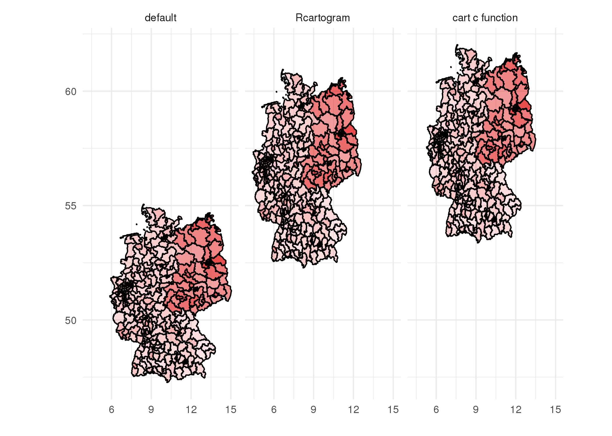

I'm leaving this sinking ship. If you like this project, checked out the maintained version on [GitLab.com](https://gitlab.com/theGreatWhiteShark/bundestagswahl2017).

---

This project started with a spontaneous and somewhat bold idea. While
the results of the election for the German parliament (Bundestag) in
2017 were still hot (2-3 days to be precise) some colleges and me
wanted to generate some catchy figures and send them to the press
include a short article about the story they are telling. This way, we
could show in upcoming applications our ability to work with data,
to present them in a neat way, and to tell their story.

We wanted to produce
[cartograms](https://en.wikipedia.org/wiki/Cartogram) of Germany
resized according to the number of votes for a specific party. In such
a map the neighbouring relation between the different states and
election districts of Germany will be conserved but their volume will
the scaled according to the number of votes. In some way this would
display the "Germany" a specific party is representing. 

Since anyone can produce such plots using some software packages, we
wanted to use the method of Mark Newman introduced in the paper
[Diffusion-based method for producing density equalizing
maps](http://www.pnas.org/cgi/content/abstract/101/20/7499), Michael
T. Gastner and M. E. J. Newman, *Proc. Natl. Acad. Sci. USA* **101**,
7499-7504 (2004). This way we could easily related it to our work.

Unfortunately the figures looked rather boring and the algorithm
seems to be tailored for sparse and concentrate densities, like the
population of the countryside vs. the population in the city, and not
for uniformly distributed number of votes. That's why there was no
press release or what so ever. 

But since it was my task to get, clean, and dig into the data, I made
a series to two blog posts out of it. If you are interested in how to
handle data or wondering what makes the job of a data scientist or
data engineer non-trivial, this might be the perfect place to start.

# Blog posts

In the [first blog
post](https://thegreatwhiteshark.github.io/thegreatwhiteshark.coding.io/data-science/bundestagswahl-pt-i/)
I covered the retrieval and cleaning of the election data in the statistical programming language **R**.

In the
[second one](https://thegreatwhiteshark.github.io/thegreatwhiteshark.coding.io/data-science/bundestagswahl-pt-ii/)
I presented a number of different ways to visualize spatial
information and also reviewed the internal handling of spatial data
objects in R. 

# Additional resources

### Data

The [data](data) folder contains references to different
sources of the data. The links might be broken by now. To still enable
you to reproduce the analysis, I uploaded all data I used to the
[bundeswahlleiter folder](https://github.com/theGreatWhiteShark/bundestagswahl2017/tree/master/data/bundeswahlleiter).

All the commands used in the first post to download and clean the
data are condensed into the
[bundeswahlleiter.R](https://github.com/theGreatWhiteShark/bundestagswahl2017/blob/master/data/bundeswahlleiter.R) script.

### Cartogram

While the figures itself do not seem to be that interesting, you might
want to still have a look at my analysis and the creation of the
cartograms. The document
[cartogram_newman.md](cartogram/cartogram_newman.md) guides you
through the generation using the [original source code](src/cart.c) of
[Mark Newman's](http://www-personal.umich.edu/~mejn/cart/) diffusion map-bases approach.

---

### License

This package is free software; you can redistribute it and/or modify it
under the terms of the GNU General Public License, version 3, as
published by the Free Software Foundation.

This program is distributed in the hope that it will be useful, but
without any warranty; without even the implied warranty of
merchantability or fitness for a particular purpose.  See the GNU
General Public License for more details.

A copy of the GNU General Public License, version 3, is available at
<http://www.r-project.org/Licenses/GPL-3>
